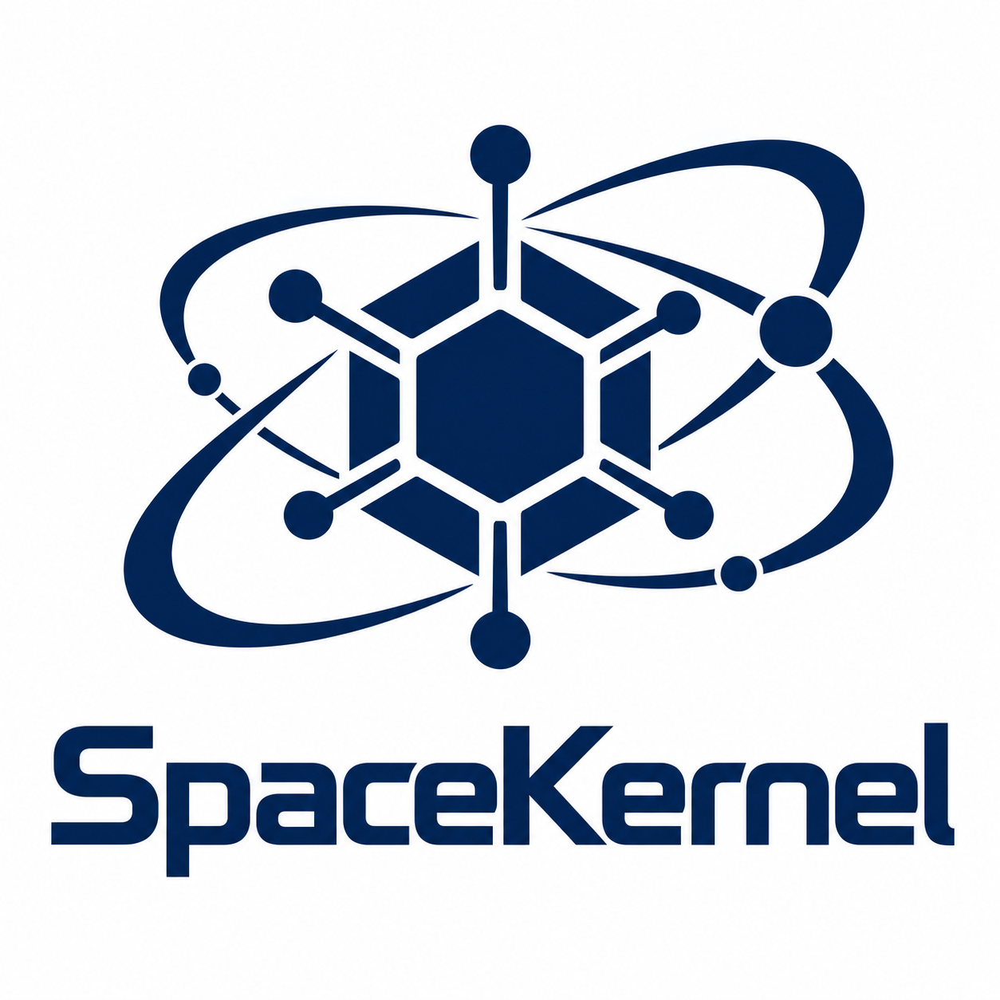

<p align="center">
  
</p>

<h1 align="center">SpaceKernel</h1>

<p align="center">基于 Rust 和 Limine 的多架构内核项目，按可编译、可启动、可测试的阶段持续开发。</p>

目前可为 **x86_64、aarch64 和 RISC-V 64** 构建启动 ISO，并在 QEMU 中运行。源码按架构、内存管理、终端、日志和硬件描述分模块组织。项目仍处于基础启动阶段；下文明确列出了当前边界。

## 快速开始

构建环境需要 Rust/rustup、GNU Make、Python 3、`tar`、`sha256sum`、`xorriso`，以及目标架构的 QEMU 和 UEFI 固件。`make menuconfig`、`make defconfig` 分别需要 Kconfig frontends 提供的 `kconfig-mconf`、`kconfig-conf`。`make` 会安装所选 Rust target、下载 Cargo 依赖，并自动获取校验过的 Limine 二进制发行包。Limine 使用 8 路并行 HTTP Range 下载；可用 `make DOWNLOAD_JOBS=16` 调整并发数。

```sh
make menuconfig  # 选择架构、debug/release、KASLR、内核命令行及 QEMU 配置
make             # 生成启动 ISO
make run         # 在 GTK 窗口中启动 QEMU；串口输出显示在当前终端
```

首次不运行 menuconfig 也可以构建：Makefile 会使用仓库内的 `.config-default`。运行 menuconfig 后，本地 `.config` 优先；用 `make defconfig` 可按 `Kconfig` 默认值重新生成它。默认命令行为 `console=tty0 console=ttyS0`，同时输出到 framebuffer 和串口；改成 `console=ttyS0` 可只使用串口。没有可用 framebuffer 时会回退到串口。

生成文件位于 `build/<arch>/<profile>/SpaceKernel-<arch>.iso`，例如 `build/x86_64/debug/SpaceKernel-x86_64.iso`。可临时覆盖配置中的架构：

```sh
make run ARCH=aarch64
make test ARCH=riscv64
```

## 测试与调试

```sh
make check                # rustfmt + 三架构 cargo check
make test ARCH=x86_64     # 构建 ISO，在无图形 QEMU 中等待串口 BOOT_OK
make test ARCH=aarch64
make test ARCH=riscv64
make debug                # QEMU 暂停在启动处，GDB 端口 1234
```

启用 `CONFIG_BOOT_SELF_TEST` 时，启动自测会检查 PMM 分配与归还、VMM 映射与地址转换、SLAB 分配、TTY 输入队列和 printk 环形记录。`make test` 是启动烟雾测试：它验证内核走到 `BOOT_OK`，并不等同于完整的硬件或并发压力测试。

## 当前实现

| 子系统 | 当前范围 |
| --- | --- |
| 启动与架构 | Limine 请求、KASLR 配置、三架构串口和页表接口、x86_64 GDT/IDT 与其他架构的异常向量 |
| 内存 | PMM 位图、内核虚拟地址区域保留与单次映射、按尺寸类别的 SLAB 及大块分配 |
| 输出 | 有界 printk 环形记录、`console=` 路由、8 个 framebuffer 虚拟终端、ANSI 基础控制与滚屏历史 |
| 硬件描述 | ACPI RSDP/SDT 校验及 MADT、FADT、MCFG、SRAT 解析；Device Tree 头部校验 |
| 构建 | Kconfig 菜单、debug/release、三架构 ISO、QEMU 运行与启动测试 |

## 源码目录

| 路径 | 职责 |
| --- | --- |
| `src/boot.rs`、`src/arch/` | Limine 响应；各架构的 CPU、分页、串口、异常与中断入口 |
| `src/mm/` | PMM、VMM、SLAB 和大块堆分配 |
| `src/pci/` | MCFG/ECAM 配置访问、固件配置总线枚举、设备快照和 capability 链解析 |
| `src/printk/` | 日志记录与有序控制台输出 |
| `src/tty/console/`、`src/tty/line/` | 控制台选择、TTY 设备分发、输入行规程 |
| `src/tty/fbcon/` | 虚拟终端状态、ANSI 解析、滚屏与像素绘制 |
| `src/hardware/acpi/`、`src/hardware/fdt.rs` | 固件硬件描述解析 |
| `src/self_test.rs`、`tools/` | 启动自测与镜像/QEMU 辅助脚本 |

## 并发约束与后续工作

共享状态由关闭本地中断的自旋锁和 acquire/release 原子操作保护。VMM 锁与各 SLAB 类锁可以获取 PMM 锁，反向获取禁止；printk 在写控制台前释放日志环锁；持有 TTY 锁时不调用分配器或日志接口。这些约束为未来启动 AP 留出了基础，但目前**只运行 BSP**。

AP 启动、跨核 TLB shootdown、VMM 解除映射、外部中断控制器与 timer IRQ、可返回的异常处理、键盘/UART 中断输入以及用户空间设备接口仍需实现。当前 ACPI 提供经校验的表视图，尚未据此驱动中断控制器或进行完整设备枚举。
